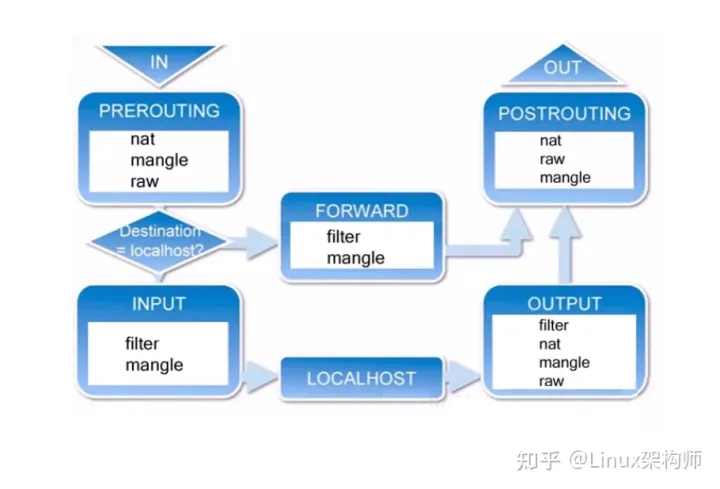
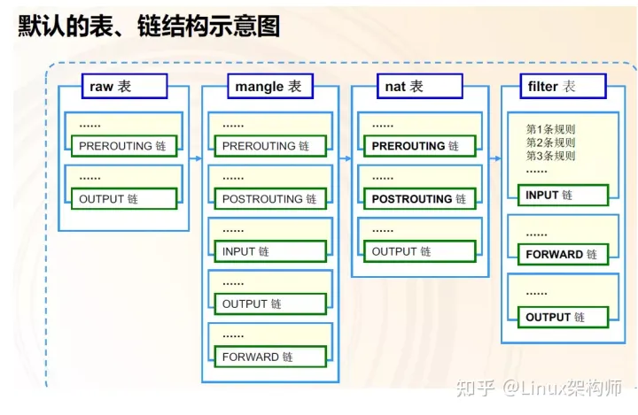
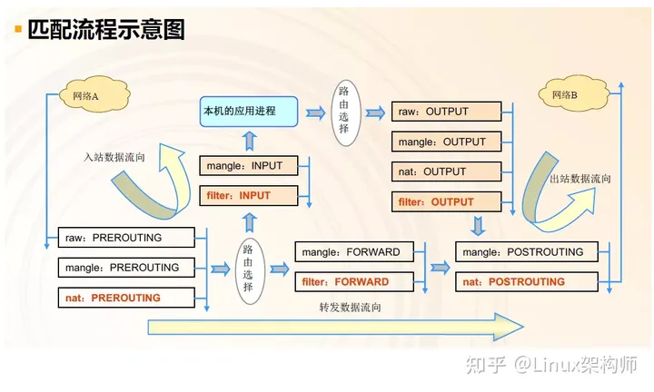
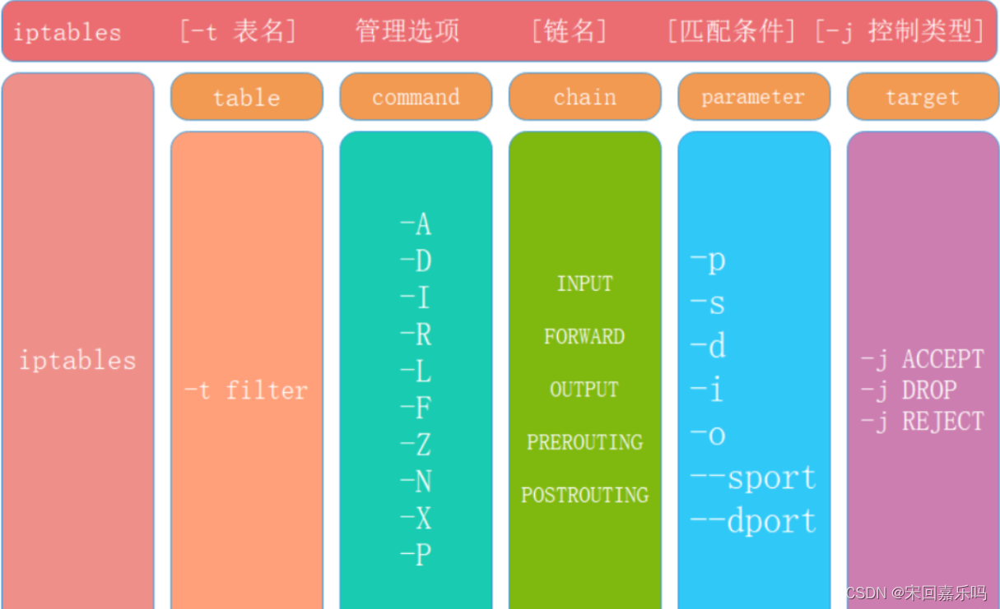
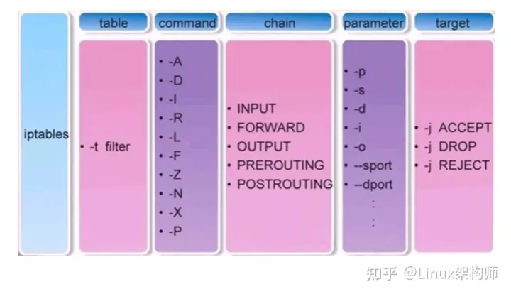
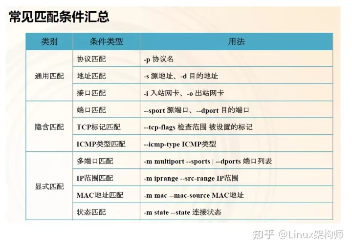
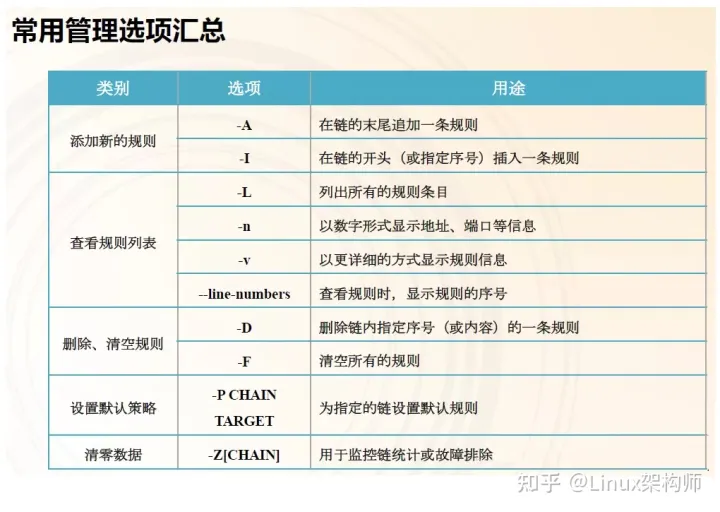
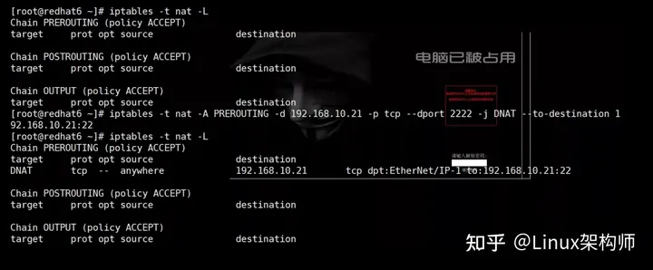
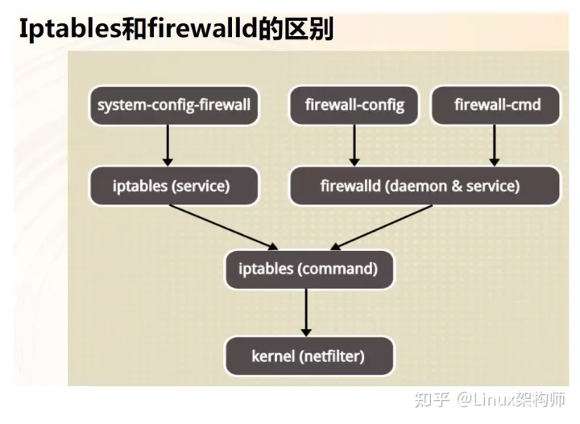

# linux 防火墙

## Netfilter

Netfilter是Linux 2.4内核引入的全新的包过滤引擎，位于Linux内核中的包过滤功能体系，基于内核控制，实现防火墙的相关策略。Netfilter 由一些数据包过滤表组成，这些表包含内核用来控制信息包过滤的规则集。Netfilter在数据包必须经过且可以读取规则的位置，设有5个控制关卡。这5个关卡处的检查规则分别放在5个规则链中叫**钩子函数**（hook functions）。也就是说5条链对应着数据包传输路径中的5个控制关卡，链中的规则会在对应的关卡检查和处理。任何一个数据包，只要经过本机，必然经过5个链中的某个或某几个。

Netfilter中的五个规则链

| 规则链      | 作用                                                         |
| ----------- | ------------------------------------------------------------ |
| PREROUTING  | 数据包刚进入网络接口之后，路由之前                           |
| INPUT       | 数据包从内核流入用户空间                                     |
| FORWARD     | 在内核空间中，从一个网络接口进入，到另一个网络接口去。转发过滤。 |
| OUTPUT      | 数据包从用户空间流出到内核空间                               |
| POSTROUTING | 路由后，数据包离开网络接口前                                 |

链其实就是包含众多规则的检查清单，每一条链中包含很多规则。当一个数据包到达一个链时，系统就会从链中第一条规则开始检查，看该数据包是否满足规则所定义的条件。如果满足，系统就会根据该条规则所定义的方法处理该数据包；否则就继续检查下一条规则，如果该数据包不符合链中任何一条规则，系统就会根据该链预先定义的默认策略来处理数据包。五条链中最常用的是 INPUT 和 OUTPUT 链。因为，我们的主机一般都是判断该是否接收数据，而转发流量一般较少。

**数据包的传输过程**

1. 当一个数据包进入网卡时，它首先进入PREROUTING链，内核根据数据包目的IP判断是否需要转送出去。
2. 如果数据包就是进入本机的，它就会沿着图向下移动，到达INPUT链。数据包到了INPUT链后，任何进程都会收到它。本机上运行的程序可以发送数据包，这些数据包会经过OUTPUT链，然后到达POSTROUTING链输出。
3. 如果数据包是要转发出去的，且内核允许转发，数据包就会如图所示向右移动，经过FORWARD链，然后到达POSTROUTING链输出。



可以看出，刚从网络接口进入的数据包尚未进行路由决策，还不知道数据要走向哪里，所以进出口处没办法实现数据过滤，需要在内核空间设置转发关卡、进入用户空间关卡和离开用户空间关卡。

## iptables

iptables是用来管理防火墙的的工具，属于静态防火墙，我们通过 iptables 将过滤规则写入内核，然后 Netfilter 再根据规则进行过滤数据包。所以实际上iptables是通过调用 Netfilter 来进行防火墙管理的，它本身不具备过滤数据包的功能。iptables程序位于 `/sbin/iptables` ，配置文件位于 `/etc/sysconfig/iptables` 。在Rhel7之前，防火墙是用 iptables

iptables中也有和netfilter中一模一样的5种规则链，还多了4个规则表。规则表的作用是容纳各种规则链。规则表的划分依据是防火墙规则的作用。四个表中常用的是 filter 表。最常用的链是 INPUT 和 OUTPUT 链

**不指定表名时，默认指定 filter 表**

iptables中的四个规则表

| 规则表   | 作用                                                 |
| -------- | ---------------------------------------------------- |
| raw表    | 确定是否对该数据包进行状态跟踪 kernel2.6之后加进去的 |
| mangle表 | 为数据包设置标记                                     |
| nat表    | 修改数据包中的源、目标ip或端口                       |
| filter表 | 确定是否放行该数据包(过滤)                           |



规则表之间的匹配顺序： raw -->mangle-->nat-->filter

**规则链之间的顺序：**

入站：PREROUTING --> INPUT

出站：OUTPUT-->POSTROUTING

转发：PREROUTING-->FORWARD-->POSTROUTING

**规则链的匹配顺序：**

按顺序依次检查， 匹配到了即停止(LOG策略例外)

若找不到相匹配的规则，则按该链的默认策略处理



**数据包的常见控制类型：**

- ACCEPT：允许通过
- DROP：直接丢弃，不给出任何回应
- REJECT：拒绝通过，必要时会给出提示
- LOG：记录日志信息，然后传给下一条规则继续匹配

**iptables的基本语法**

语法构成：iptables 【-t 表名】 选项 链名 条件 【-j 控制类型】

> iptables [-t 表名] 管理选项 [链名] [匹配条件] [-j 控制类型]

1.不指定表名时，默认指filter表
2.不指定链名时，默认指表内的所有链
3.除非设置链的默认策略，否则必须指定匹配条件
4.选项、链名、控制类型使用大写字母，其余均为小写

- 不指定链名时，默认指定表内的所有链
- 除非设置链的默认策略，否则必须指定匹配条件
- 选项、链名、控制类型使用大写字母，其余均为小写





> ## 常用的控制类型
>
> ACCEPT   允许数据包通过。
> DROP    直接丢弃数据包，不给出任何回应信息。
> REJECT  拒绝数据包通过，会给数据发送端一个响应信息。
> SNAT     修改数据包的源地址。
> MASQUERADE   伪装成一个非固定公网IP地址。
> DNAT     修改数据包的目的地址。
> PNAT  目标端口转换 端口修改
> LOG      在/var/log/messages文件中记录日志信息，然后将数据包传递给下一条规则。LOG只是一种辅助动作，并没有真正处理数据包。

**规则的匹配条件**

通用匹配：可直接使用，不依赖于其他条件或扩展。包括网络协议、ip地址、网络接口等

- 协议匹配：-p 协议名 `iptables -A INPUT -p icmp -j DROP`
- 地址匹配：-s 源地址 、-d 目的地址 `iptables -A INPUT -s 192.168.10.0/24 -j DROP`
- 接口匹配：-i 入站网卡 、-o 出站网卡`iptables -A INPUT -i eth0 -p icmp -j DROP`

隐含匹配：要求以特定的协议匹配作为前提，包括端口、TCP标记、ICMP类型等条件

- 端口匹配：--sport 源端口 、--dport 目的端口 `iptables -A INPUT -p tcp --dprot 20:21 -j ACCEPT`
- TCP标记匹配：--tcp-flags 检查范围 被设置的标记
- ICMP类型匹配：--icmp-type ICMP类型

显式匹配：要求以 " -m 扩展模块" 的形式明确指出类型，包括多端口、MAC地址、IP范围、数据包状态等

- 多端口匹配：-m multiport --sport 源端口列表 -m multiport --dport 目的端口列表`iptables -A INPUT -p tcp -m multiport --dport 25,80,110,143 -j ACCEPT`
- IP范围匹配：-m iprange --src-range IP范围 `iptables -A FORWARD -p tcp -m iprange --src-range 192.168.4.21-192.168.4.28 -j ACCEPT`
- MAC地址匹配： -m mac --mac-source MAC地址`iptables -A INPUT -m mac --mac-source 00:0c:29:c0:55:3f -j DROP`



**添加新的规则：**

-A：在链的末尾追加一条规则
-I ：在链的开头(或指定序号插入)一条规则

- `iptables -t filter -A INPUT -p tcp -j ACCEPT`
- `iptables -A INPUT -p tcp -j ACCEPT`
- `iptables -I INPUT -p udp -j ACCEPT`
- `iptables -I INPUT 3 -p icmp -j ACCEPT` 在filter表中的INPUT链中的第3条加入一条允许所有icmp协议的规则

**删除，清空规则(暂时，重启失效)**

-D：删除链内指定序号的一条规则
-F：清空所有的规则

- `iptables -D INPUT 3`
- `iptables -t raw -F`
- `iptables -F`

**查看规则列表**

-L：列出所有的规则条目 （默认查看的是filter表）
-n：以数字形式显示地址、端口等信息 (地址用数字表示)
-v：以更详细的方式显示规则信息(显示比特流，发包的数量等信息)
--line-numbers：查看规则时，显示规则的序号

- `iptables -L`
- `iptables -nvL`

**设置默认规则**

-P：为指定的链设置默认规则

- `iptables -t nat -P OUTPUT ACCEPT`



**规则的备份和还原**

导出( 备份规则)：`iptables-save > /tmp/xie/1.txt`

//将iptables配置文件保存到 /tmp/xie/1.txt文件中

还原规则：`iptables-restore < /tmp/xie/1.txt`

**规则永久生效：**

iptables不是一个守护进程，我们修改只是当前的修改，重启服务或重启系统就会失效。要想使规则永久生效，需要保存规则： service iptables save ，使我们当前的配置保存到配置文件 /etc/sysconfig/iptables 中，然后重启服务或者重启主机，使规则加载到内存，才能使配置永久生效。防火墙的运行需要建立在网络配置正常的前提下。

`services iptables start / stop / restart` 开启/停止/重启 iptables服务

`chkconfig --level 5 iptables on / off`

**iptables做本地端口转发**

开启数据转发功能：`/etc/sysctl.conf` 设置 `net.ipv4.ip_forward=1`

```shell
iptables -t nat -L         #查看端口转发记录
##将192.168.10.21的2222端口的流量都转发给192.168.10.21的22端口
iptables -t nat -A PREROUTING \
  -d 192.168.10.21 -p tcp --dport 2222 \
  -j DNAT --to-destination 192.168.10.21:22           
iptables -save             #保存
iptables -t nat -F         #清除规则
```

做本地端口转发，将本地2222端口的流量转发给22端口



### 示例

#### SNAT

源地址转换 （Source Network Address Translation）

> 实现内网主机通过防火墙进行上网，需要使用SNAT（源地址转换POSTROUTING）

```shell

iptables -t net -A POSTROUTING  -s 192.168.100.0/24 -o eth0 -j SNET --to-source 192.168.200.10

# 指定从哪个ip地址转换出去（静态公网地址）
iptables -t nat -I POSTROUTING -s 172.16.1.0/24 -j SNAT --to 10.0.0.200
iptables -t nat -L -n
```

#### MASQUERADE

伪装

```shell
# 当外网源地址为动态获取的地址时，MASQUERADE可自行判断要转换为的外网地址
iptables -t nat -A POSTROUTING -s 172.16.1.0/24 -j MASQUERADE
```

#### DNAT

目标地址转换 (Destination Network Address Translation)

> 实现外网主机通过防火墙访问内部主机80端口，需要通过DNAT（目标地址转换PREROUTING）

```shell
# 地址映射【DNAT】
iptables -t nat -I PREROUTING -d 10.0.0.200 -j DNAT --to 172.16.1.7
```

#### PNAT

目标端口转换

```shell
# 端口映射【DNAT】
iptables -t nat -I PREROUTING \
-d 10.0.0.200 -p tcp --dport 80 \
-j DNAT --to 172.16.1.7:80
iptables -t nat -L -n

#把来自80端口的访问映射到本机的8080端口
iptables -A PREROUTING -t nat \
-d 192.168.10.11 -p tcp --dport 80 -j REDIRECT --to-ports 8080

```

## Firewalld

Firewalld自身并不具备防火墙的功能，而是和iptables一样需要通过内核的Netfilter来实现，也就是说firewalld和iptables一样，他们的作用都是用于维护规则，而真正使用规则干活的是内核的Netfilter，只不过Firewalld和iptables的结构以及使用方法不一样罢了。iptables是动态防火墙 dynamic firewall daemon 。支持ipv4和ipv6。Rhel7中默认将防火墙从iptables升级为 firewalld。firewalld相对于iptables主要的优点有：

- firewalld在使用上要比iptables人性化很多，即使不明白“四张表五条链”而且对TCP/IP协议也不理解也可以实现大部分功能。

**firewalld的配置模式**

firewalld的配置文件以xml格式为主（主配置文件firewalld.conf例外），他们有两个存储位置

1. /etc/firewalld/services/ 用户自定义配置文件
2. /usr/lib/firewalld/services/ 系统配置文件，预置文件，尽量不要修改



**过滤规则集合：zone**

- 一个zone就是一套过滤规则，数据包必须要经过某个zone才能入站或出站。不同zone中规则粒度粗细、安全强度都不尽相同。可以把zone看作是一个出站或入站必须经过的安检门，有的严格、有的宽松、有的检查的细致、有的检查的粗略。

- 每个zone单独对应一个xml配置文件，在目录`/usr/lib/firewalld/services/`

- 每个zone都有一个默认的处理行为，包括：default(省缺)、 ACCEPT、REJECT、DROP

- firewalld提供了9个zone：

  - - drop 任何流入的包都被丢弃，不做任何响应。只允许流出的数据包。
  - block 　 任何流入的包都被拒绝，返回`icmp-host-prohibited`报文(ipv4)或`icmp6-adm-prohibited`报文(ipv6)。只允许由该系统初始化的网络连接
  - public 默认的zone。部分公开，不信任网络中其他计算机，只放行特定服务。
  - external 只允许选中的服务通过，用在路由器等启用伪装的外部网络。认为网路中其他计算器不可信。
  - dmz 允许隔离区(dmz)中的电脑有限的被外界网络访问，只允许选中的服务通过。
  - work 用在工作网络。你信任网络中的大多数计算机不会影响你的计算机，只允许选中的服务通过。
  - home 用在家庭网络。信任网络中的大多数计算机，只允许选中的服务通过。
  - internal 用在内部网络。信任网络中的大多数计算机，只允许选中的服务通过。
  - trusted 允许所有网络连接，即使没有开放任何服务，那么使用此zone的流量照样通过（一路绿灯）。

**防火墙默认只激活public区域，不指定区域，默认是 public 区域**

防火墙状态监测

- `firewall-cmd --list-all` //列出所有的已配置接口的配置信息
- `firewall-cmd --state` //查看防火墙的状态
- `firewall-cmd --get-active-zones` //查看防火墙激活的zone区域
- `firewall-cmd --get-services` //查看防火墙预定义的服务
- `firewall-cmd --get-default-zone`//查看防火墙默认的zone区域
- `firewall-cmd --set-default-zone=home` //将防火墙默认的区域设置为home区域
- `firewall-cmd --get-service --permanent` //查看永久生效的服务
- `firewall-cmd --list-rich-rules` //列出所有的富规则

**防火墙的配置**

在区域中添加服务或端口：

临时设置：`firewall-cmd -zone=public --add-service=mysql`

`firewall-cmd --add-port=8080-8081/tcp` //不写区域的话默认是public区域

在区域中移除服务或端口：

临时设置：`firewall-cmd --remove-service=https`

`firewall-cmd --remove-port=8080-8081/tcp`

在区域中永久添加和移除服务或端口(--permanent参数)：

永久设置：`firewall-cmd --permanent --add-service=mysql`

`firewall-cmd --permanent --remove-port=8080-8081/tcp`

`firewall-cmd --reload` //重载，永久设置需要重载配置文件才能生效

富规则：富规则允许你创建更复杂的配置

- `firewall-cmd --zone=public --add-rich-rule="rule family="ipv4" source address="192.168.10.0/24" service name=ssh accept "` //zone区域添加一个富规则，允许来自源网段192.168.10.0/24 的数据
- `firewall-cmd --permanent --zone=public --add-rich-rule="rule family="ipv4" source address="192.168.10.0/24" port protocol="tcp" port="8080" accept"` //在zone区域中永久添加一个富规则，允许来自源网段 192.168.10.0/24 的tcp协议的8080端口的数据
- `firewall-cmd --zone=public --remove-rich-rule="rule family="ipv4" source address="192.168.10.0/24" service name="http" accept "` //移除zone区域的富规则--来自192.168.10.0/24网段的http服务

**防火墙的选择**

Rhel7中既有iptables防火墙，又有firewalld防火墙。但是同一时刻只能开一个，所以必须得关闭其中一个防火墙。一般我们都是关闭iptables防火墙，而打开firewalld防火墙，因为firewalld比iptables强大太多了。

开启firewalld防火墙，并且使其开机自启动，关闭iptables防火墙

- `systemctl mask iptables.service` //屏蔽iptables服务
- `systemctl start firewalld.service`
- `systemctl enable firewalld.service`

打开路由转发功能 ：

- `echo 1 > /proc/sys/net/ipv4/ip_forward`
- `sysctl -w net.ipv4.ip_forward=1`
- `vim /etc/sysctl.conf`, 将`net.ipv4.ip_forward=0` 改为 =1，然后 `sysctl -p /etc/sysctl.conf` 使之生效 (永久开启IP转发)

端口转发：

```shell
# 将外部访问本机10000端口的流量转发至本机22号端口
firewall-cmd --zone=public \
--add-rich-rule="rule family=ipv4 forward-port port=10000 protocol=tcp to-port=22" 

# 将外部访问本机8080端口流量转到192.168.10.24上的80端口
firewall-cmd --zone=public \
--add-forward-port=port=8080:proto=tcp:toport=80:toaddr=192.168.10.24
```

### 示例
